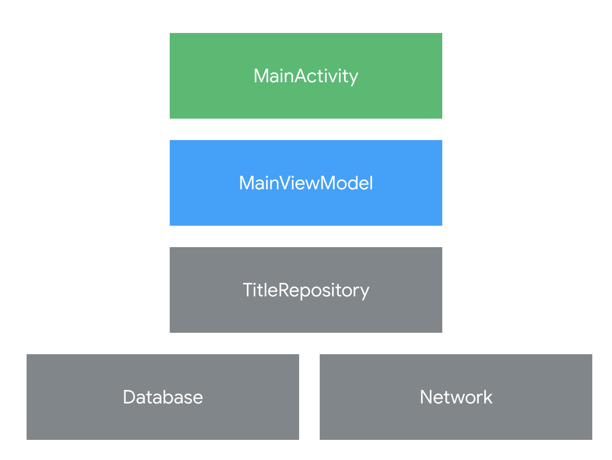

# android-coroutines

안드로이드에서 코루틴 사용법을 알아봅시다

[코틀린 공식 문서](https://kotlinlang.org/docs/coroutines-overview.html)

<br>

코루틴: 데이터베이스 또는 네트워크 액세스와 같이 오래 실행되는 작업의 비동기 콜백을 순차 코드로 변환하는 Kotlin의 기능이다.

```kotlin
이번 code lab에서 코루틴을 이용하여 첫번째 코드를 두번째 코드와 같이 바꿀 수 있다.

// Async callbacks
networkRequest { result ->
    // Successful network request
    databaseSave(result) { rows ->
        // Result saved
    }
}

// 코루틴을 적용한 코드
// The same code with coroutines
val result = networkRequest()
// Successful network request
databaseSave(result)
// Result saved
```

<br>

## Set up

**기본 요건**

- ViewModel, LiveData, Repository, Room 아키텍처 구성요소 사용 경험
- 확장 함수 및 람다를 포함한 Kotlin 구문 사용 경험
- Android에서 기본 스레드, 백그라운드 스레드, 콜백을 비롯한 스레드를 사용하는 방법에 관한 기본적인 이해

**학습 목표**

- 코루틴으로 작성된 코드를 호출하고 결과 확인
- `suspend 함수`를 사용하여 비동기 코드를 순차적으로 실행
- `launch` 및 `runBlocking`을 사용하여 코드 실행 방식을 제어
- `suspendCoroutine`을 사용하여 기존 API를 코루틴으로 변환
- 아키텍처 구성 요소에서 코루틴을 사용
- 코루틴 테스트를 위한 모범 예시

<br>

## sample app

처음에 주어진 코드는 버튼을 클릭하면 짧은 delay 후에 count가 올라가는 간단한 기능을 가집 앱이다.

**structure**



<br>

## Coroutines in Kotlin

안드로이드에서는 **main thread**를 block 하는 상황을 방지하는 것이 중요하다.  <br>
메인 스레드는 UI의 모든 업데이트를 담당하는 싱글 스레드이다. (click handler, ui callback 등..) <br>
-> 유저 경험을 위해 smoothly하게 동작해야한다.

사용자에게 멈춤 없이 앱을 보여주긴 위해서는, 메인 스레드가 매 16ms 마다 화면을 업데이트 해야한다. (약 1초에 60 frame) <br>
그럼 이 시간보다 더 오래 걸리는 작업(예: JSON 파싱, DB 작성, network 등..)을 메인 스레드에서 수행하게 되면 앱이 멈출 수도 있다. <br>
그리고 메인 스레드를 오래 block하고 있으면, ANR(Application Not Responding)이 발생하게 된다.

<br>

### callback

메인스레드를 차단하지 않고 오래 걸리는 작업을 수행하는 패턴 중에는 **callback**이 있다. <br>
콜백을 사용하면, 백그라운드에서 작업을 수행할 수 있다. <br>
콜백은 작업이 끝나면 메인 스레드에 결과를 알린다. <br>

```kotlin
@UiThread
fun makeNetworkRequest() {
    // The slow network request runs on another thread
    slowFetch { result ->
        // When the result is ready, this callback will get the result
        show(result)
    }
    // makeNetworkRequest() exits after calling slowFetch without waiting for the result
}
```

위의 코드를 확인해보자. `@UiThread` 어노테이션을 달고 있다. 즉, 메인 스레드에서만 사용할 수 있다는 뜻이다. <br>
하지만, `slowFetch`를 사용하기 때문에 이 메서드는 slowFetch 작업이 끝나길 기다리지 않고 즉시 반환된다. <br>
즉, 백그라운드 스레드에서 요청을 처리하여 UI를 멈추지 않고 관리할 수 있다. <br>
작업이 완료되면 콜백을 사용하여 결과를 show(result)에 전달하고, show(result)는 메인스레드에서 실행되어 UI를 업데이트 할 수 있다.

<br>

### Using Coroutines

콜백의 큰 단점은 많이 사용하면 가독성이 많이 떨어진다는 점이다. (콜백지옥 아시죠?) <br>
코루틴을 사용하면 콜백 기반의 코드를 sequential한 코드로 변환할 수 있다. (가독성 상승) <br>
즉, 비동기 작업을 마치 동기 작업처럼 작성할 수 있다. <br>
여기에 +) 콜백에서는 어려울 수 있는 예외처리도 쉽게 가능해진다. <br>

`suspend` 키워드가 붙은 함수들은 실행 중간에 말 그대로 **중지** 할 수 있다. <br>
아래 코드에서는 slowFetch가 suspend 함수이기 때문에 위의 콜백 예시와 달리 result를 기다렸다고 makeNetworkRequest 함수가 종료된다.

 <br>

```kotlin
// Slow request with coroutines
@UiThread
suspend fun makeNetworkRequest() {
    val result = slowFetch()
    // continue to execute after the result is ready
    show(result)
}

// slowFetch is main-safe using coroutines
suspend fun slowFetch(): SlowResult {
    ...
}
```

<br>

## Control UI with coroutines

### CoroutineScope

모든 코루틴은 코루틴스코프 내에서 실행된다. <br>
**CoroutineScope** : 모든 코루틴이 실행디는 범위를 정의하는 객체. 코루틴의 생명주기를 관리한다. <br>
**Job** : 각 코루틴의 작업 단위. 코루틴의 상태(예: 실행 중, 취소 등..)를 추적한다. <br>
코루틴 스코프는 해당 스코프에서 실행되는 모든 코루틴을 한번에 관리할 수 있다. <br>
-> Job을 취소하면, 그 coroutineScope 안에서 실행 중인 모든 코루틴이 취소된다. <br>

 <br>

**작업 취소**

activity나 fragment에서 코루틴 스코프를 사용하여 사용자가 화면을 이동 할 때, Job을 취소하여 UI 관련 모든 코루틴을 취소할 수 있다. <br>
이런 방식은 리소스 누수를 방지하고, 불필요한 작업들을 중지시킬 수 있다.

- Dispatchers.Main: 메인 스레드(UI 스레드)에서 코루틴을 실행. 메인 스레드에서 실행된 코루틴은 UI를 업데이트하거나 사용자 입력을 처리하는 데 사용한다.
- Dispatchers.IO: 입출력 작업(I/O)을 처리하는 데 최적화된 디스패처. 파일 입출력, 네트워크 요청 등과 같은 시간이 많이 걸리는 작업에 사용된다.
- Dispatchers.Default: CPU 연산이 많은 작업(예: 데이터 처리, 복잡한 계산 등)에 적합한 스레드 풀에서 코루틴을 실행한다.

UI 작업을 수행하는 코루틴은 주로 Dispatchers.Main에서 실행해야 한다. <br>
이 디스패처는 메인(UI) 스레드에서 작업을 실행하지만, 코루틴이 일시 중단(suspended)되는 동안 메인 스레드를 차단하지 않는다. <br>
즉, 코루틴이 suspend 상태가 되는 동안 메인 스레드는 계속 다른 작업을 처리할 수 있다. <br>

dispatcher 교체는 `withContext` 함수를 통해 이루어진다.

 <br>

**main-safety**

Room 및 Retrofit 같은 라이브러리는 코루틴 사용 시 기본적으로 메인 세이프티를 제공하기 때문에 네트워크 또는 데이터 베이스 호출을 위해 스레드를 관리할 필요는 없다. <br>
물론 지원하지 않는 라이브러리나 blocking code(목록 정렬, 파일 리딩 등..)같은 경우에는 메인 세이프티를 위해 명시적인 코드가 필요하다.

Room과 Retrofit 모두 사용자 지정 디스패처를 사용하며 Dispatchers.IO를 사용하지 않는다. <br>
Room은 구성된 기본 쿼리와 트랜잭션 실행기를 사용하여 코루틴을 실행한다. <br>
Retrofit은 내부적으로 새 Call 객체를 생성하고 이 객체에 큐를 호출하여 요청을 비동기적으로 전송한다. 

 <br>

### viewModelScope

viewModelScope를 사용하면 뷰모델 내에서 코루틴을 쉽게 실행하고 관리할 수 있다. <br>
뷰모델 스코프는 기본적으로 Dispachers.Main에 바인딩 된다. <br>
뷰모델 스코프 내에서 실행된 코루틴들은 뷰모델의 생명 주기에 자동으로 맞춰진다. <br>
화면 회전이나 구성 변경에서도 살아남고, 사용자가 화면을 벗어나면 뷰모델도 제거된다. <br>
뷰모델 스코프는 뷰모델이 클리어 될 때 자동으로 모든 코루틴을 취소(`onCleared`)하기 때문에 리소스 낭비나 메모리 누수 등을 방지할 수 있다.

<br>

---

🤔 코루틴에 대해 자세히 알고 싶다면 !

[Coroutines: first things first](https://medium.com/androiddevelopers/coroutines-first-things-first-e6187bf3bb21) <br>
[Cancellation in coroutines](https://medium.com/androiddevelopers/cancellation-in-coroutines-aa6b90163629) <br>
[Exceptions in coroutines](https://medium.com/androiddevelopers/exceptions-in-coroutines-ce8da1ec060c) <br>

[Coroutines guide](https://kotlinlang.org/docs/coroutines-guide.html)
